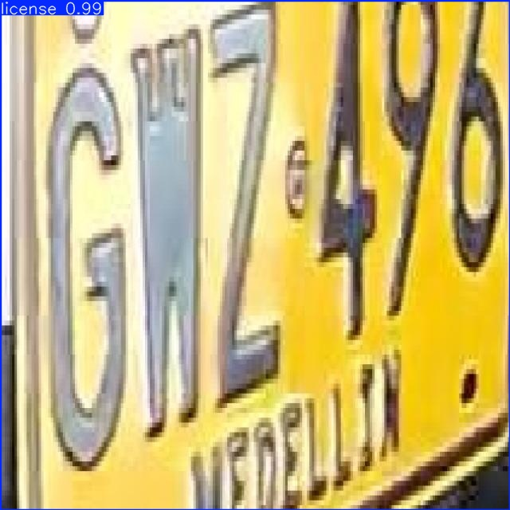
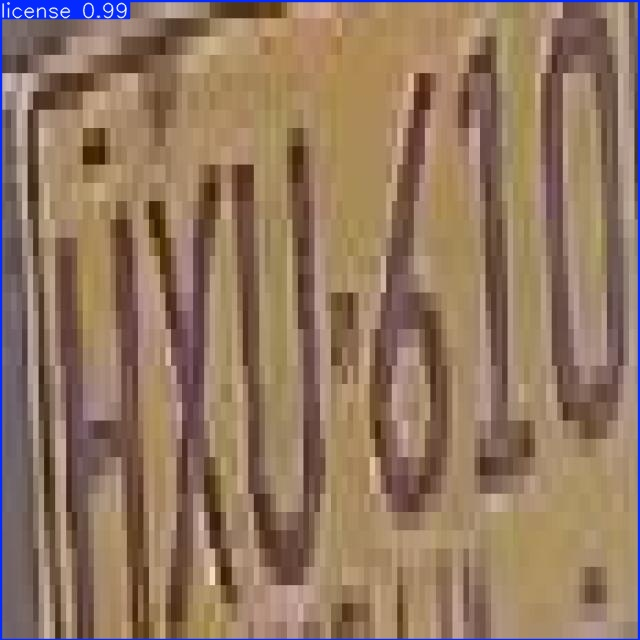

# Object Detection with YOLOv8

##  Description
This project implements an object detection system using YOLOv8 to detect cars and license plates. The model was trained on a custom dataset obtained from Roboflow and executed using Google Colab with GPU acceleration.

---

## Tech Stack
- Python
- YOLOv8 (Ultralytics)
- PyTorch
- OpenCV
- Roboflow

---

## Dataset
Custom dataset downloaded from Roboflow in YOLOv8 format, containing annotated images of cars and license plates.

---

## Training
- Model: yolov8n
- Epochs: 10
- Image size: 640
- Environment: Google Colab (GPU T4)

---

## Results
The model successfully detects cars and license plates in test images.

### Performance Metrics
- mAP50: ~0.42

---

## Sample Output

---

##  How to Run
1. Open the notebook in Google Colab
2. Install dependencies (`ultralytics`, `roboflow`)
3. Download dataset from Roboflow
4. Train the model
5. Run predictions

---

## Future Improvements
- Train with more epochs
- Use larger YOLOv8 models (yolov8s, yolov8m)
- Improve dataset quality

---

## The model was able to detect cars and license plates with good accuracy. YOLOv8 achieved consistent predictions across test images.
